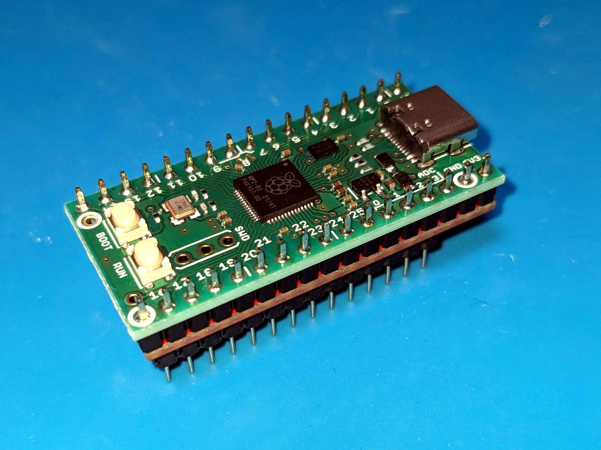
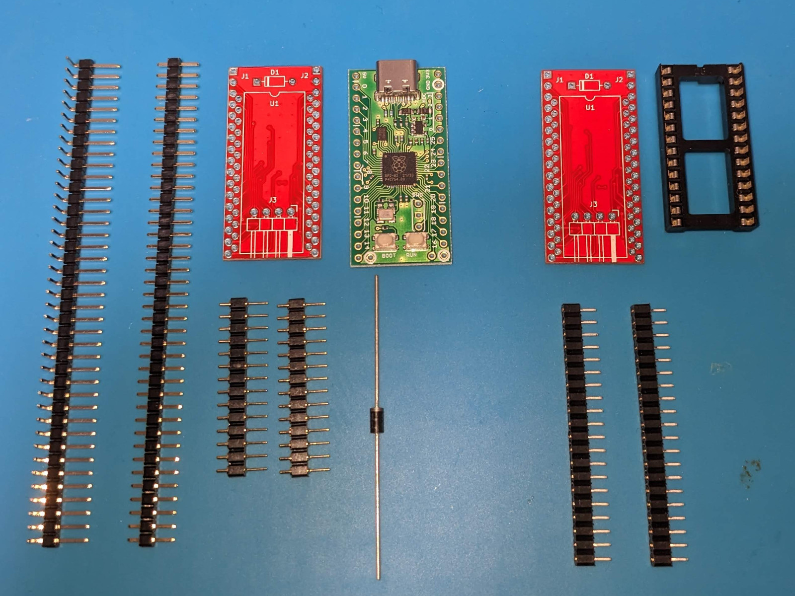
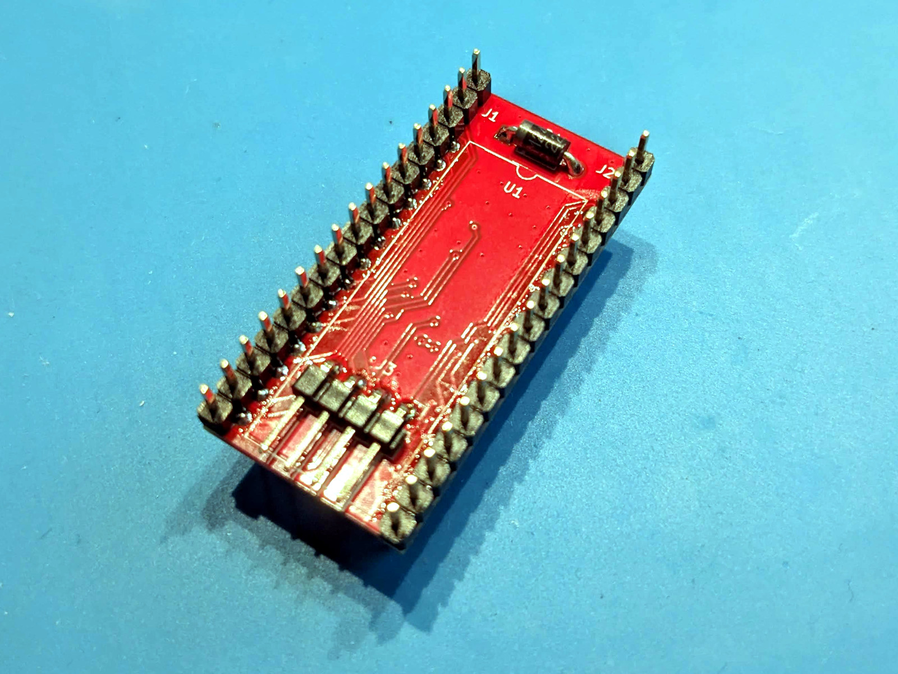
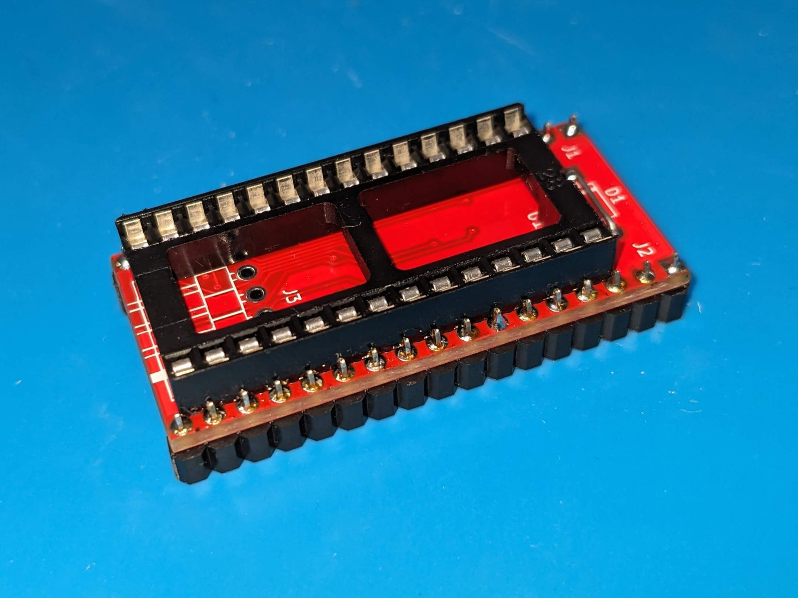
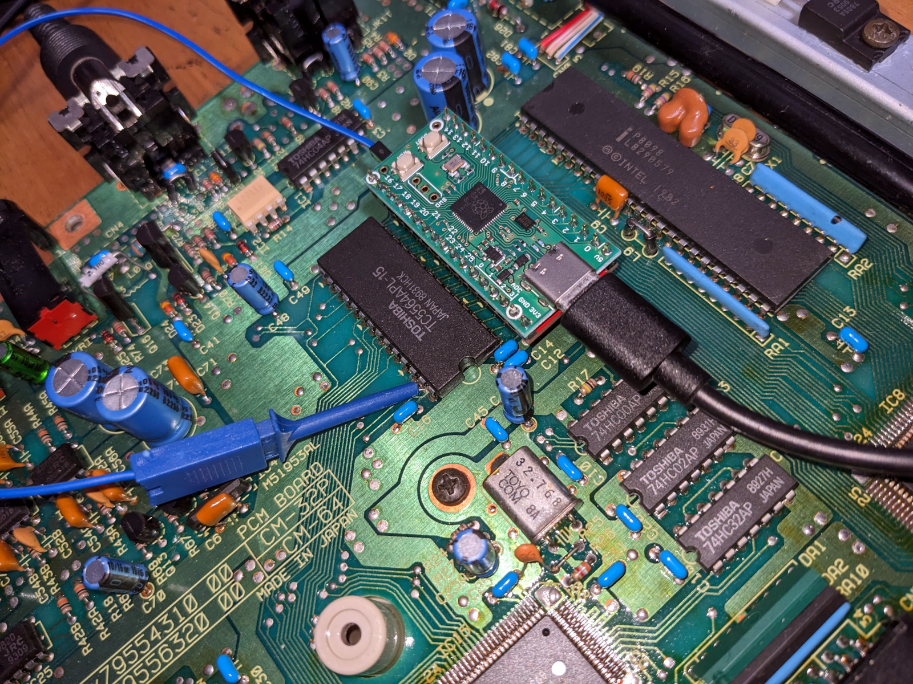
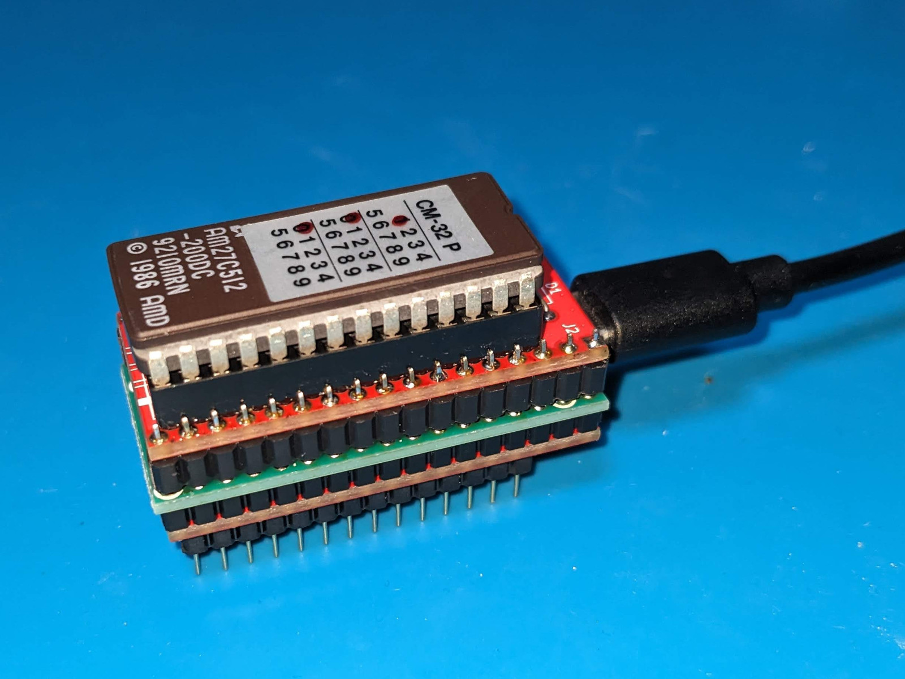
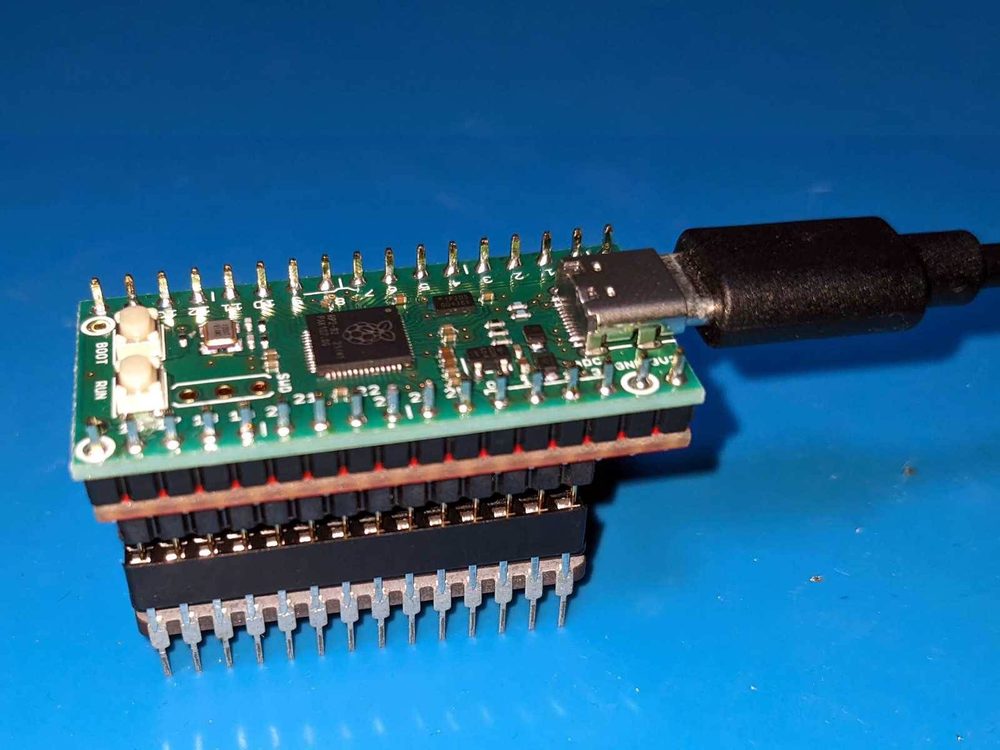

# RP27C512

**RP27C512**は、秋月電子通商の[RP2040マイコンボードキット(AE-RP2040)](https://akizukidenshi.com/catalog/g/g117542/)を使用して、
EP-ROM(27C512)のエミュレーションを行うデバイスです。
このデバイスは、AE-RP2040のGPIOを27C512相当のDIP-28ピンアサインに変換する基板と、GPIOを制御するためのファームウェアで構成されています。

ROMのエミュレーションに加え、同一バス上のメモリやデバイスへのアクセスを監視・解析する機能も備えていることが特長です。

ROMデータ書き換えて機器やプログラムの動作確認をしたり、
メモリの内容やデバイスのアクセスを監視して機器の挙動を調べる用途を想定しています。

興味のある方がいらっしゃれば、基板やキットの頒布を検討しますので、お声掛けください。



## 概要

* 27C512の代わりに**RP27C512**を装着して、ROM機能をエミュレーションすることができます。
* /OE信号がアサートされてから約40nsでデータ出力が可能です。
* **RP27C512**をホスト(Windows PCやMac)に接続すると、USBシリアルポートとして認識されます。
* UARTターミナルを使って、コマンドラインインターフェースから各種操作が可能です。
* ROMデータはAE-RP2040のフラッシュメモリに最大4つまで保存でき、切り替えて使用できます。
* ホストからROMデータを**RP27C512**に転送できます。転送にはXMODEMを使用します。
* **RP27C512**に保存されたROMデータをホストに転送することが可能です。転送にはXMODEMを使用します。
* **RP27C512**をROM(27C512)に接続し、実チップからデータを直接読み出すことができます。
* **RP27C512**の基板を流用して、ROM(27C512)を**RP27C512**に接続するための子基板を作ることができます。
* バスアクセスの監視機能を備えており、同一バス上に接続されたメモリやデバイスへのアクセスを解析できます。
  * 書き込みデータを**RP27C512**のRAMに記録して、確認できます。機器のRAMの内容に相当します。
  * RAMのデータをXMODEMを使用してホストとの間で転送することが可能です。
  * 指定した領域へのアクセスを時系列で表示することができます。

## ハードウェア

* [RP27C512/AE-RP2040変換基板](hardware/)は、AE-RP2040のピンアサインを27C512相当に変換するシンプルな基板です。
* 回路図や基板レイアウトはKiCadで作成しており、`hardware/`ディレクトリに格納しています。
* AE-RP2040のGPIOは3.3Vで、27C512は5Vで駆動しますが、レベル変換回路は入れていません。
  作者の環境では正常に動作していますが、故障や想定外の動作について作者は責任を負いかねます。
* RP2040を400MHzまでオーバークロックして使用しています。
* 27C512側の5V電源をAE-RP2040に供給することが可能です。ショットキーバリアダイオードで逆流防止を行っています。

### 信号の接続関係

|AE-RP2040|接続先|信号名|補足                             |
|---------|------|------|---------------------------------|
|GPIO0-15 |27C512|A0-15 |アドレスバス                     |
|GPIO16-23|27C512|DQ0-7 |データバス                       |
|GPIO27   |27C512|/CE   |チップイネーブル                 |
|GPIO28   |27C512|/OE   |出力イネーブル                   |
|GPIO29   |基板  |/WR   |4Pピンヘッダ1/書き込みイネーブル |
|GPIO24   |-     |-     |4Pピンヘッダ2/将来用             |
|GPIO25   |-     |-     |4Pピンヘッダ3/将来用             |
|GPIO26   |-     |-     |4Pピンヘッダ4/将来用             |
|GND      |27C512|VSS   |                                 |
|+5V      |27C512|VCC   |ショットキーバリアダイオード経由 |
|+3.3V    |-     |-     |                                 |

### 部品一覧

[RP27C512/AE-RP2040変換基板](hardware/)の他に必要になる部品の一覧です。
秋月電子通商で揃える場合の例です。電気的に接続するだけなので、同等品で問題ありません。
子基板はcloneモードでROMを接続しやすくするためのもので、ROMエミュレーションには必要ありません。

* 親基板(本体)
  * [RP2040マイコンボードキット](https://akizukidenshi.com/catalog/g/g117542/)
  * [ロープロファイルピンヘッダー(低オス) 1×40(40P) 9.54mm](https://akizukidenshi.com/catalog/g/g100171/)
    * 子基板を取り付けない場合は
      [ロープロファイルピンヘッダー(低オス) 1×40(40P) 7.7mm](https://akizukidenshi.com/catalog/g/g102900/)
      でよいでしょう。
  * [丸ピンIC用連結ソケット 1×14 MH-1X14-L2](https://akizukidenshi.com/catalog/g/g116982/)
    * 秋葉原の店舗には常備していないようなので要注意です。
    * [丸ピンIC用連結ソケット 両端オスピン・1列14P](https://akizukidenshi.com/catalog/g/g100862/)のピンを切断して使っても、
      [細ピンヘッダー 1×40 (黒)](https://akizukidenshi.com/catalog/g/g106631/)を使ってもよいでしょう。
  * [ピンヘッダー (オスL型) 1×40 (40P)](https://akizukidenshi.com/catalog/g/g101627/)
  * [ショットキーバリアダイオード 45V2A SBM245L](https://akizukidenshi.com/catalog/g/g117439/)
* 子基板(cloneモード用)
  * [シングルピンソケット (低メス) 1×20 (20P)](https://akizukidenshi.com/catalog/g/g103138/)
  * [ICソケット (28P) 600mil](https://akizukidenshi.com/catalog/g/g115763/)
  * スズメッキ線少々
    * 親基板のダイオードのリード線の残りで問題ないでしょう。



### 組み立て(親基板)

各部品を部品を基板にハンダ付けして取り付けます。
スペースが狭く、干渉するので、ハンダの量が多くなりすぎないように注意します。

* ショットキーバリアダイオードを基板に取り付けます。
  * USBケーブルからの電源のみで使用する場合は、必要はありません。
  * ダイオードの太さによってはAE-RP2040と接触します。作者は気にしていません。
* 丸ピンIC用連結ヘッダを基板に取り付けます。
  * ロープロファイルピンヘッダーとの距離が狭いため、両方を基板に固定した状態でハンダ付けするとよいです。
* ロープロファイルピンヘッダーを基板に取り付けます。
  * 9.54mmタイプを使用する場合は、足の長いピンが上方(AE-RP2040側)になる向きにします。
* L型ピンヘッダーを4P分に切断し、基板に取り付けます。
  * 先に取り付けてしまうと、樹脂部分が邪魔で、丸ピンIC用連結ヘッダの半田付けが難しくなります。
* ロープロファイルピンヘッダーにAE-RP2040を取り付けます。
  * 基板間が狭いので、スペースを残すためにQIコネクタを取り付けた状態でハンダ付けするとよいです。
  * 子基板を使用する場合、ハンダが上方に付着していると子基板のピンソケットに刺さりません。
    スルーホール付近にだけハンダが乗るようにします。多くつき過ぎた場合は、ハンダ吸い取り線で除去するのがよいです。



### 組み立て(子基板)

cloneモードでROMを接続しやすくするための基板です。

* スズメッキ線をダイオードの代わりにD1の位置に取り付けます。
* ICソケットを取り付けます。
  * 次に取り付けるシングルピンソケットも基板に固定した状態でハンダ付けするとよいです。
* シングルピンソケットを17P分に切断し、基板に取り付けます。



## ファームウェア

* このプログラムは[Raspberry Pi Pico-series C/C++ SDK](https://www.raspberrypi.com/documentation/pico-sdk/)でビルド可能です。
* ソースコードは`firmware/`ディレクトリに格納しています。
* ビルド後に生成される`rp27c512.uf2`を所定の方法で**RP27C512**に書き込み、使用します。

## ファームウェアのビルド

事前に Raspberry Pi Pico SDK をインストールし、下記のコマンドでビルドすることができます。

```sh
git clone https://github.com/hyano/rp27c512.git
cd rp27c512
mkdir build
cd build
cmake ..
make
cp rp27c512.uf2 /Volumes/RPI-RP2
```

## 使用方法

### ハードウェアの取り付け

* 基板のICソケットからROM(27C512)を外し、代わりに**RP27C512**を取り付けます。
* 書き込みアクセスをキャプチャする場合は、基板下側の4Pピンヘッダのうち、シルクが白く塗りつぶされたピンを/WR信号に接続します。
* ホストとUSBケーブルで接続すると、USBシリアルポートとして認識されます。
* USBケーブルを接続しなくても基板側の電源で動作しますが、**RP27C512**の起動時間が必要なため、接続先の機器の起動に間に合わないかもしれません。
* 基板下側のピンヘッダの残り3Pは将来拡張用です。他の信号キャプチャや、機器のリセットなどの制御に使用することを検討しています。


### コマンドラインインタフェース

**RP27C512**をホストとUSBケーブルで接続すると、USBシリアルポートとして認識されます。
UARTターミナルを使って、コマンドラインインターフェースから各種コマンドを使用して操作することができます。

|コマンド|引数|説明|モード|
|-|-|-|-|
|help, ?|-|ヘルプを表示する。|e/c|
|hello|any...|コマンドラインの動作確認用。与えられた引数を表示する。|e/c|
|reboot|[delay]|再起動する。delayで再起動までの秒数を指定可能。|e/c|
|mode|"emulator"\|"clone"|ROMエミュレーションを行うemulatorモードとROMの読み出しを行うcloneモードを切り替える。modeはFLASH ROMに保存される。コマンド実行完了後、自動的に再起動する。|e/c|
|bootsel|[delay]|RP2040をBOOTSELモードで再起動する。|e/c|
|gpio|-|GPIOの状態を表示する。|e/c|
|device|"rom"\|"ram"|操作対象のデバイスをROMかRAMで切り替える。ダンプ、データ転送に影響する。|e/-|
|d|[addr]|デバイス上のデータを指定したアドレスから16進ダンプする。アドレスを省略すると前回の続きをダンプする。|e/c|
|dw|[addr]|何かキーが押されるまで、16進ダンプを繰り返す。RAM上のデータの変化を目視するために使う。|e/-|
|dlen|len ["save"]|16進ダンプする時の表示行数を設定する。数値の後にsaveオプションをつけると設定をFLASH ROMに保存する。|e/c|
|watch|start end|指定したアドレス範囲をcapコマンドでキャプチャするよう設定する。|e/-|
|unwatch|start end|指定したアドレス範囲をcapコマンドでキャプチャしないよう設定する。|e/-|
|cap|-|設定したアドレス領域へのアクセスを時系列に従って表示する。|e/-|
|wsave|-|capコマンドでキャプチャする範囲を保存する。|e/-|
|recv|-|ホストからデバイスにデータを転送する。64KiBのバイナリデータをXMODEM(CRC)で転送する。|e/c|
|send|-|デバイスからホストにデータを転送する。64KiBのバイナリデータをXMODEM(1K)で転送する。|e/c|
|bank|0\|1\|2\|3|使用するFLASH ROMのバンクを指定する。バンクの指定はFLASH ROMに保存され、次回起動時はそのバンクからROMデータを読み出す。|e/c|
|load|-|FLASH ROMからデータを読み出す。bankコマンドで指定したバンクを使用する。|e/c|
|save|-|FLASH ROMにデータを保存する。bankコマンドで指定したバンクを使用する。|e/c|
|erase|0\|1\|2\|3|FLASH ROMのデータを消去する。バンク番号を明示的に指定する。|e/c|
|clone|[wait [verify]]|直接接続した27C512からデータを読み出す。読み出し開始までの秒数(wait)と、ベリファイ回数(verify)を指定できる。|-/c|
|init|"all"\|"rom"\|"config"|FLASH ROMのデータ、設定を初期化する。設定を初期化する場合は、自動的に再起動する。|e/c|

* モードはe(emulatorモード)、c(cloneモード)を示します。
* [arg]は省略可能な引数を表します。
* FLASH ROMにアクセスするコマンドを実行すると、動作クロック周波数を一時的に下げるためにROMエミュレーションが乱れます。
* 引数のチェックはほとんどしていないので、不正な引数を指定するとすぐに暴走します。

### emulatorモード

emulatorモードは、**RP27C512**をROM(27C512)の代わりに動作させるモードです。
`mode emulator`コマンドでemulatorモードに切り替わります。
ROMを基板のICソケットから取り外し、代わりに**RP27C512**を取り付けます。
ROMが基板直付けの場合は、ICソケットを取り付けると良いでしょう。

書き込みアクセスをキャプチャするには、基板下側の4Pピンヘッダのうち、シルクが白く塗りつぶされたピンを/WR信号に接続します。



**RP27C512**の起動時にFLASH ROMからROMデータが読み出され、すぐにROMのエミュレーションが開始されます。

ROMデータは、USBターミナルソフトからXMODEMで転送するか、後述のcloneモードで実チップから読み出すかで、
あらかじめ**RP27C512**のFLASH ROMに保存しておきます。
FLASH ROMアクセス中は、**RP27C512**の動作クロック周波数を下げる必要があるため、ROMのエミュレーション速度が落ちます。
基板から取り外すか、基板の電源を切った状態で作業すると良いでしょう。

### cloneモード

cloneモードは、**RP27C512**を直接ROM(27C512)の実チップに接続して、データを読み出すモードです。
`mode clone`コマンドでcloneモードに切り替わります。

子基板を使用する場合は、子基板にROMを取り付け、子基板を**RP27C512**に上から接続します。
ROMの電源はUSBポートから供給されます。



子基板を使用しない場合は、ROMに上から被せる形で**RP27C512**を乗せ、ピン同士を接触させます。
**RP27C512**を直接被せるのではなく、平ピン型のICソケットを間に挟むと、より接触させやすいです。
ROMの電源は外部から供給しても良いですし、**RP27C512**のショットキーバリアダイオードをバイパスしてUSBポートから供給しても良いでしょう。



接続ができたら、`clone`コマンドで実チップからデータを読み出します。
読み出しに成功したら、`save`コマンドでFLASH ROMに保存して、`mode emulator`でemulatorモードに戻しておきます。

**RP27C512**内のROMデータは、XMODEMでホスト側に転送することもできますので、簡易ROMリーダとしても使用することができます。


```sh
> mode clone
mode: clone
rebooting...

connected.
RP27C512 VER1.00
rom bank: 0
mode: clone
> clone
read ROM
 wait  : 5 s
 verify: 2 times
read start ... done.
verify (1/2) ... OK
verify (2/2) ... OK
clone: OK
> bank 0
current rom bank: 0
> save
save: OK
> mode emulator
mode: emulator
rebooting...


connected.
RP27C512 VER1.00
rom bank: 0
mode: emulator
> 
```

## ROMエミュレーションの実装

ROMエミュレーションは、データ出力部とバス制御部から構成されます。
アドレスバス(A0-A15)と制御信号(, /OE)の状態に応じて、データバス(D0-D7)に値を出力します。

### データ出力部

データ出力部は、アドレスバス(A0-A15)で指定されたアドレスに対応するROMイメージのデータを、データバス(D0-D7)に設定します。
PIOステートマシン1つ(SM)と、DMAを2チャネル(DMA0, DMA1)使用して実現しています。

* SMには、ROMイメージの配列変数の先頭アドレスの上位16ビットを転送して初期化します。
  * ROMイメージの配列変数は64KiBにアラインメントしておきます。
* SMは、GPIO(A0-A15)を読み出し、アクセス先のアドレスを合成し、FIFOに送信します。
* DMA0はSMのFIFOを監視するように設定しておき、SMからアドレスが送られてきたら、DMA1にそのアドレスからデータ転送を指示します。
* DMA1は、DMA0から指示されたアドレスからデータを読み出し、SMのFIFOに書き込みます。
* SMはDMA1から送られてきたデータをGPIO(D0-D7)に出力します。
* 上記を繰り返します。

### バス制御部

バス制御部は、制御信号(/CE, /OE)を監視し、データバス(D0-D7)を出力状態を制御します。
PIOステートマシン1つで実現しています。

* SMは、GPIO(/CE, /OE)の値を確認します。
* 両方が0の場合は、GPIO(D0-D7)を出力モードに切り替えます。
* そうでない場合は、GPIO(D0-D7)を入力モード(ハイインピーダンス)に切り替えます。
* 上記を繰り返します。

## バスアクセス監視の実装

バスアクセス監視は、書き込みデータ取り込み部とアクセスデータキャプチャ部から構成されます。

### 書き込みデータ取り込み部

書き込みデータ取り込み部は、書き込みアクセスがあると、アドレスバス(A0-A15)で指定されたRAMイメージのアドレスに、
データバス(D0-D7)の値を書き込みます。
PIOステートマシン1つ(SM)とDMAを2チャネル(DMA0, DMA1)使用して実現しています。

* SMには、ROMイメージの配列変数の先頭アドレスの上位16ビットと、
  0~256をあらかじめ書き込んだ値データの配列変数の先頭アドレスの上位24ビットを転送して初期化します。
  * RAMイメージの配列変数は64KiBにアラインメントしておきます。
  * 値データの配列変数は256Bにアラインメントしておきます。
* SMは、GPIO(/WR)の立ち上がりを待ち、その時のGPIOの値をキャプチャします。
* SMは、GPIO(D0-D7)の値から値データのアドレスを合成し、FIFOに送信します。
* SMは、GPIO(A0-A15)の値からRAMアクセス先のアドレスを合成し、FIFOに送信します。
* DMA0はSMのFIFOを監視するように設定しておき、SMからアドレス二つが送られてきたら、DMA1にそのアドレス間のデータ転送を指示します。
* DMA1は、DMA0から指示された値データのアドレスからデータを読み出し、RAMイメージのアドレスに書き込みます。
* 上記を繰り返します。

### アクセスデータキャプチャ部

アクセスデータキャプチャ部は、制御信号(/WR, /OE)を監視し、変化があるとその内容を64エントリのリングバッファに取り込みます。
PIOステートマシン1つ(SM)とDMAを2チャネル(DMA0, DMA1)使用して実現しています。

* SMは、GPIO(/WR, /OE)を確認します。
* 両方が1に変化した時、その時のGPIO(A0-A15, D0-D7, EXT0-EXT2, /CE)の値と直前のGPIO(/WR, /OE)の値を合成して、FIFOに送信します。
* DMA1は、SMから送られてきたデータをリングバッファに書き込みます。
  * リングバッファは、256Bにアラインメントしておきます。
  * リングバッファのどこまで書き込んだかは、DMAの書き込み先アドレスを確認することで知ることができます。
* リングバッファの終端に到達すると、DMA1は転送を終了して、DMA0をトリガします。
* DMA0は、DMA1の転送先アドレスをリングバッファの先頭に設定して、DMA1を再起動します。
* 上記を繰り返します。


## 注意事項

* 作者の手元のごく少数の機器でのみ動作確認しています。すべての機器での動作を保証することはできません。
* 作者は、本デバイスの使用による一切の損害について責任を負いかねます。使用は使用者の責任で行ってください。

## 利用しているオープンソースソフトウェア

* [XMODEM implementation](https://github.com/Thuffir/xmodem)
  * Copyright 2001-2019 Georges Menie (www.menie.org)
  * Modified by Thuffir in 2019
* [Micro Read Line library for small and embedded devices with basic VT100 support](https://github.com/dimmykar/microrl-remaster)
  * Author: Eugene Samoylov aka Helius (ghelius@gmail.com) 01.09.2011
  * Remastered by: Dmitry Karasev aka dimmykar (karasevsdmitry@yandex.ru) 27.09.2021

## 参考文献・ソフトウェア

* [An RP2040-based ROM emulator](https://github.com/wickerwaka/PicoROM)
* [PIO/DMA implementation of picoROM project to simulate an EEPROM using a Raspberry Pico](https://github.com/rhulme/picoROM_pio)
* [Raspberry Pi Pico-series C/C++ SDK](https://datasheets.raspberrypi.com/pico/raspberry-pi-pico-c-sdk.pdf)
* [RP2040 Datasheet](https://datasheets.raspberrypi.com/rp2040/rp2040-datasheet.pdf)

## ライセンス

このソフトウェアは[MITライセンス](LICENSE)にて提供しています。  
Copyright (c) 2024 Hirokuni Yano

利用しているオープンソースソフトウェアは、そのライセンスに従います。